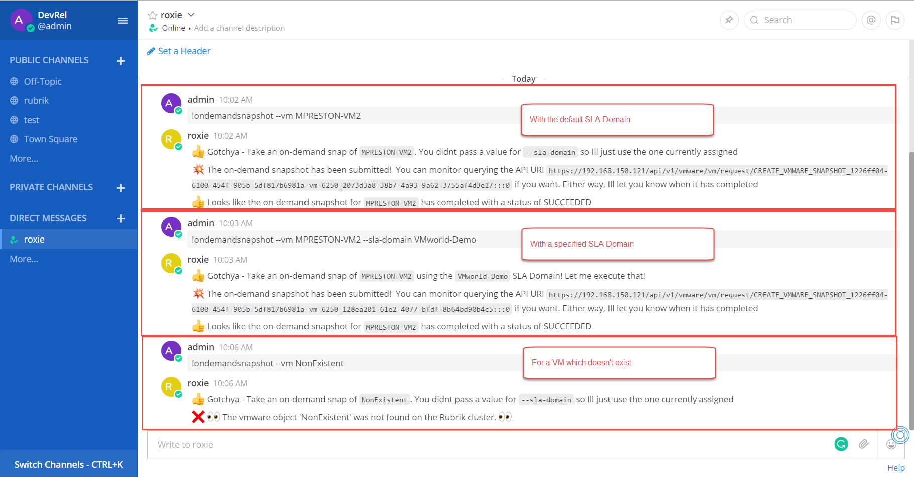
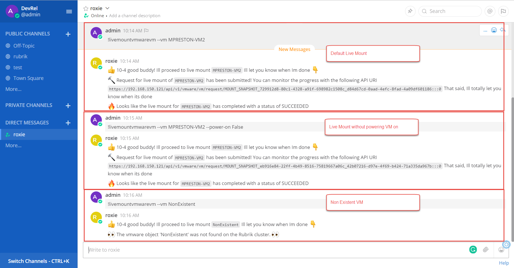

# Introduction to the Rubrik Plugin for Errbot

Errbot is a python based chatbot that connects to your favorite chat service and brings your tools into the conversation. This plug-in extends Errbot's architecture to bring Roxie, Rubrik's intelligent personal assistant into the fold. Utilizing the Rubrik Plugin for Errbot allows organizations to integrate common cloud data management tasks into their preferred collobaration platforms, granting end-users to chat or query the plugin in order to perform functions through simple conversation such as:

- Assigning an SLA Domain to a Rubrik object
- Taking an on-demand snapshot of a Virtual Machine
- Performing a Live Mount of a Virtual Machine

The Rubrik Plugin for Errbot will interpret the natural conversation and peform the respective API calls to a Rubrik cluster in order to perform the requested functionality, while responding back to the users within the chat service.

*Note: While Errbot can be utilized on it's own, the real power comes when it is accessed through a bot within a chat service. This guide will walk through the process of setting up Errbot and the Rubrik Plugin for Errbot with [Mattermost](https://www.mattermost.com), an on-premises, open source messaging platform. To use Errbot with other messaging platforms such as Slack see the official [Errbot documentation](https://errbot.readthedocs.io/en/latest/).*

# Prerequisites

The code assumes that you have already deployed at least one Rubrik cluster into your environment and have completed the initial configuration process to form a cluster. This code also assumes that Mattermost, the chat service Errbot will connect to, has been downloaded and configured properly.

The following software packages are prerequisites in order to support the Rubrik Plugin for Errbot and Mattermost.

1. [Python3](https://www.python.org/download/releases/3.0/)
1. [virtualenv](https://virtualenv.pypa.io/en/latest/)
1. [git](https://git-scm.com/)
1. [Mattermost CLI](https://docs.mattermost.com/administration/command-line-tools.html) - if using the automated installation method

# Installation

This guide will walk through the basic steps in order to get Errbot and the Rubrik Plugin for Errbot installed, configured, and connected to a Mattermost instance. For further information and more detailed installation instructions, refer to the [Official Errbot Documentation]().

After completing this guide the following applications and packages will be installed:

1. Errbot
1. mattermostdriver
1. Mattermost Backend for Errbot
1. Rubrik SDK for Python
1. Rubrik Plugin for Errbot

Installation can be performed in two different manners; Automated or Manual, outlined below.

## Automated Installation

For convenience we have developed a script which will automate all of the actions performed in the Manual Installation section. 

**Note: The automated installation only works when you wish to install all components on the same server which runs Mattermost.**

To run an automated installation use the following steps:

1. Download the automated script [here](/install/install.sh)
1. Execute the script by running `./install.sh` **Script must be executed as root**
1. The script will prompt for various bits of information including installation directories, Mattermost configuration, Rubrik configuration, and Bot configuration. Be sure to input everything correctly when prompted.
1. Upon completion, Errbot, Mattermost Backend for Errbot, MattermostDriver, and the Rubrik Plugin for Errbot will be installed.
1. A basic configuration based on inputs provided will be automatically applied during the script execution. If changes are required, more details around this can be found in the [`Configuring the Rubrik Plugin for Errbot`](#Configuring-the-Rubrik-Plugin-for-Errbot) section.

## Manual installation

The manual installation process can be broken down into three subsections; Installing Errbot, Installing the Rubrik Plugin for Errbot, and Installing the Mattermost Backend for Errbot

### Installing Errbot

The first step to creating our Roxie bot involves getting Errbot installed, configured, and running. While package managers may be used for certain Linux distrobutions, the following will walk through the more prefered installation method using virtualenv:

1. Create a new python3 based virtual environment

    `virtualenv --python ``which python3`` /usr/share/errbot`

1. Install Errbot using pip

    `/usr/share/errbot/bin/pip install errbot`

1. Install the Rubrik SDK for Python

    `/usr/share/errbot/bin/pip install rubrik_cdm`

1. Activate the virtualenv

    `source /usr/share/errbot/bin/activate`

1. Create and switch to a directory to host the errbot instance.

    `mkdir /usr/share/errbot/roxie && cd /usr/share/errbot/roxie`

1. Initialize the directory for Errbot. This will copy the nessessary files, as well as a default configuration file to our working directory

    `errbot --init`

### Installing the Rubrik Plugin for Errbot 

1. Download the Rubrik Plugin for Errbot

    `git clone https://github.com/mwpreston/rubrik-roxie-plugin-for-errbot.git /tmp/rubrik-roxie`

1. Copy the Rubrik Plugin for Errbot to the working directory

    `cp -r /tmp/rubrik-roxie/rubrik-errbot/rubrik /usr/share/errbot/roxie/plugins/`

Errbot and the Rubrik Plugin for Errbot have now been successfully installed. We can quickly test the installations by running the `errbot` command from within our working directory as follows:


Errbot will now be started in text/developer mode. Here we can test that Errbot is responding by issuing the `!tryme` command, which in turn calls an example plugin which was loaded during the `errbot --init` process. A succesful Errbot installation will respond with 'It works !' as shown below:


To confirm that the Rubrik Plugin for Errbot has been successfully loaded issue the `!status plugins` command and search for the Rubrik plugin. A properly working pluging will have an 'A' displayed for its status to indicate it has been activated. The following illustrates a properly function Rubrik plugin:


This mearly ensures that our plugin is working. Configuration still needs to occur before it is able to connect to a Rubrik cluster. Before that however, the next step is to get Errbot talking to Mattermost.

### Installation of the mattermostdriver and Errbot for Mattermost Backend

In order for Mattermost to talk to Errbot and vice-versa we have to connect the two application utilizing a backend. A backend is simply a connector which leverages web hooks allowing communication to flow between Mattermost and Errbot. The following steps outline the installation and configuration for both the mattermostdriver and the backend:

1. Install the mattermostdriver packages through pip. **Ensure the virtualenv for Errbot is still active**

    `/usr/share/errbot/bin/pip install mattermostdriver`

1. Clone the Errbot Backend for Mattermost to a desired directory.

    `git clone https://github.com/Vaelor/errbot-mattermost-backend.git /usr/share/errbot/mattermost`

1. Use the Mattermost CLI to create a user to use as your bot. The user must be assigned the system admin role.  We like to call ours Roxie

    `/opt/mattermost/bin/mattermost user create --email roxie@rubrik.us --username roxie --password SuperSecret123! --system_admin`

    

    **Optionally you may use the `Invite People` option from the main menu within your Teams Mattermost space.

1.  Modify the `config.py` configuration file within the working directory (/usr/share/errbot/roxie if following along), pointing it to the mattermost backend and configuring the bot.

    For example, we want to change the default `config.py` which looks something like this...
    
    ```
    import logging

    # This is a minimal configuration to get you started with the Text mode.
    # If you want to connect Errbot to chat services, checkout
    # the options in the more complete config-template.py from here:
    # https://raw.githubusercontent.com/errbotio/errbot/master/errbot/config-template.py

    BACKEND = 'Text'  # Errbot will start in text mode (console only mode) and will answer commands from there.

    BOT_DATA_DIR = '/usr/share/errbot-mattermost/data'
    BOT_EXTRA_PLUGIN_DIR = '/usr/share/errbot-mattermost/plugins'

    BOT_LOG_FILE = '/usr/share/errbot-mattermost/errbot.log'
    BOT_LOG_LEVEL = logging.DEBUG

    BOT_ADMINS = ('@CHANGE_ME', )  # !! Don't leave that to "@CHANGE_ME" if you connect your errbot to a chat system !!
    ```
    
    To this

    ```
    import logging

    # This is a minimal configuration to get you started with the Text mode.
    # If you want to connect Errbot to chat services, checkout
    # the options in the more complete config-template.py from here:
    # https://raw.githubusercontent.com/errbotio/errbot/master/errbot/config-template.py

    BACKEND = 'Mattermost'  
    BOT_EXTRA_BACKEND_DIR = '/usr/share/errbot/mattermost' # This points where we cloned the Mattermost Backend
    BOT_DATA_DIR = '/usr/share/errbot/roxie/data' # This points to where we first initialized our Errbot instance
    BOT_EXTRA_PLUGIN_DIR = '/usr/share/errbot/roxie/plugins/' # This points to where we first initialized our Errbot instance
    BOT_LOG_LEVEL = logging.DEBUG
    BOT_LOG_FILE = '/var/log/errbot/errbot.log'

    BOT_IDENTITY = {
            # Required
            'team': 'devrel',
            'server': '10.10.15.26',
            # For the login, either
            'login': 'roxie@rubrik.us',
            'password': 'SuperSecret123!',
            # Optional
            'insecure': True,
            'scheme': 'http',
            'port': 8065 # Default = 8065
    }

    BOT_ADMINS = ('@admin', )  # !! Don't leave that to "@CHANGE_ME" if you connect your errbot to a chat system !!
    ```

1. Add the following line to your virtualenv activate script(/usr/share/errbot/bin/activate if following along). This ensures the newly cloned Mattermost backend directory is part of the PYTHONPATH environment variable within the virtual environment.

    ```
    export PYTHONPATH=/usr/share/errbot/mattermost:$PYTHONPATH
    ```

We have now completed all of the installations required and can begin to run our Errbot instance.

### Running the Errbot instance

The Errbot instance, Mattermost Backend and Rubrik plugin are now ready to be started. To start Errbot with our desired configuration run the following command:

`source <path_to_errbot_install>/bin/activate && <path_to_errbot_install>/bin/errbot -c <path_to_working_directory>/config.py`

If following along with this guide, the command would look as follows:

`source /usr/share/errbot/bin/activate && /usr/share/errbot/bin/errbot -c /usr/share/errbot/roxie/config.py`

Passing the `-d` parameter to errbot will start the process in daemon (background) mode:

`source /usr/share/errbot/bin/activate && /usr/share/errbot/bin/errbot -d -c /usr/share/errbot/roxie/config.py`

#### Configuring Errbot and Roxie to start on system boot

The following will walk through how to setup the Roxie to start upon boot using systemd.

1. Create a startup script to start Errbot passing the Roxie configuration file. Save the file as `runroxie` within the `/usr/bin` directory on the local system.  The following shows an example of a `runroxie` file.

    ```
    source /usr/share/errbot/errbot/bin/activate && /usr/share/errbot/errbot/bin/errbot -d -c /usr/share/errbot/roxie/config.py &

    while true; do
        sleep 100
    done
    ```

1. Create a systemd service file pointing to the `runroxie` script. Save the file as `roxie-errbot.service` within the `/lib/systemd/system/` directory on the local system. The following shows an example of a `roxie-errbot.service` file.

    ```
    [Unit]
    Description=Rubrik Plugin for Errbot
    After=mattermost.service

    [Service]
    Type=simple
    ExecStart=/bin/bash /usr/bin/runroxie

    [Install]
    WantedBy=multi-user.target
    ```

1. Reload systemctl using the following command:

    `systemctl daemon-reload`

1. Start the Roxie service using the following command:

    `systemctl start roxie-errbot`

1. To have the service persist on a reboot, enable the service with the following command:

    `systemctl enable roxie-errbot`

The Rubrik Plugin for Errbot will now start upon a reboot of the machine. Before using the plug-in however, it must be configured.

# Configuring the Rubrik Plugin for Errbot

Before issuing commands against a Rubrik cluster we need to configure the Node_IP and API_Token configuration elements within the Rubrik Plugin for Errbot.

Errbot plugins can be configured either by using the `errbot` cli command or through the bot itself.

**NOTE: If the automated installation option was chosen, the Rubrik Plugin for Errbot will already be completed. There is no further configuration needed.**

## Configuration with errbot cli

Adding the Rubrik Plugin for Errbot configuration can be accomplished by passing the desired API_Token and Node_IP JSON values through the --storage-merge parameter.

**Note: You cannot update the configuration of the Rubrik Plugin for Errbot while Errbot is running. The process must be stopped before continuing**

The following command can be used to configure the Rubrik Plugin for Errbot through the errbot cli:

`echo "{'configs': {'Rubrik': {'API_TOKEN': '<Rubrik API Token>', 'NODE_IP': '<NODE IP TO USE>'}}}" | <path_to_errbot>/bin/errbot -c <path_to_errbot_config.py> --storage-merge core`

Once errbot is started again commands to the bot can be issued.

## Configuration through Matterbost bot

Errbots pluggable architecture allows the configuration of its' plugins to be performed within Errbot itself. For the sake of this guide, we will perform the configuration of the Rubrik Plugin for Errbot directly from within Mattermost through direct messages with our bot user. The following outlines how to configure the Rubrik Plugin for Errbot (within Mattermost):

1. Log into Mattermost as a user with *System Admin* priveleges.

1. Find the bot user created to handle the communication with the Rubrik Plugin for Errbot. If following this guide, that would be *Roxie*

1. Issue the following command to retrieve the current configuration of the Rubrik Plugin for Errbot. *Commands are simply entered in as a DM to the bot*

    `!plugin config Rubrik`

1. As shown below there are two pieces of information we need to configure; `Node_IP` and `API_Token`

    

    `Node_IP` - representing a node or cluster IP/DNS
    `API_Token` - A generated API token within Rubrik with administrative priveleges

1. To modify the configuration values, simply send the same command with the proper JSON values appended:

    

The Rubrik Plugin for Errbot has now been configured. You may begin issuing commands to the bot.

# Using the Rubrik Plugin for Errbot

Like many other Errbot plugins, the Rubrik Plugin for Errbot will respond to commands that are prefixed with an exclamation mark (`!`). Some commands will require parameters, while others do not. The following will walk through four of the most popular commands within the Rubrik Plugin for Errbot:

**Retrieving the Rubrik Cluster software version**

To retrieve the software version of the currently connected Rubrik cluster, simply send the `!sofwareversion` command as a DM to your bot. As shown below, the bot will in turn issue the API calls to retrieve this information, parse it, and respond back to the DM:


**Assigning an SLA Domain to a VMware VM**

An SLA Domain may be assigned to a VMware VM by issuing the `!assignslavmware` command and providing values for the following 2 arguments:
* `--vm` - (String, Required) The virtual machine in which to assing the SLA Domain to.
* `--sla-domain` - (String, Required) The desired SLA Domain name to assign.

For example, to assign a virtual machined named VM1 to an SLA Domain named Gold, the following command is issued:

`!assignslavmware --vm VM1 --sla-domain Gold`

The bot will in turn issue the commands to assign the SLA Domain to the virtual machine, and respond with a message outlining the result. Illustrated below are a few of the possible outcomes when assigning an SLA Domain:


**Performing an on-demand snapshot of a VMware VM**

The Rubrik Plugin for Errbot may be used to trigger on-demand snapshots of VMware VMs by issuing the `!ondemandsnapshot` and providing the following arguments:
* `--vm` - (String, Required) the virtual machine in which to perform the backup on
* `--sla-domain` - (String, Optional) the SLA Domain of which to apply to the backup. If no value is passed, the VMs currently assigned SLA Domain will be used.

For example, to take an on demand snapshot of a VM named VM1 with the Gold SLA Domain the following command is issued:

`!ondemandsnapshot --vm VM1 --sla-domain Gold`

To take an on demand snapshot of the same VM with the currently assigned SLA Domain the following commmand is issued:

`!ondemandsnapshot --vm VM1`

The bot will in turn issue the commands to the Rubrik cluster to take the on-demand snapshot and respond with a message outlining the result. Illustrated below are a few of the possible outcomes when taking on-demand snapshots



**Performing a Live Mount of a VMware VM**

The Rubrik Plugin for Errbot may be used to create Live Mounts of VMware VM backups by issuing the `!livemountvmwarevm` command and providing the following arguments:
* `--vm` - (String, Required) The Virtual Machine you wish to Live Mount
* `--date` - (String, Optional) The date of the restore point you wish to Live Mount. By default the latest date will be utilized
* `--time` - (String, Optional) The time of the restore point on the specified date you wish to Live Mount. By default the latest time will be utilized.
* `--host` - (String, Optional) The name of IP Address of the ESXi host you wish to run the Live Mounted VM. By default, the host currently running the production VM will be utilized
* `--remove-network-devices` - (Boolean, Optional) - Whether you wish to remove the network devices from the Live Mounted VM. By default, this is set to False.
* `--power-on` - (Boolean, Optional) - Whether you wish to power on the Live Mounted VM. By default, this is set to True.

For example, to Live Mount a VM named VM1 using all of the default parameter values the following command is issued:

`!livemountvmwarevm --vm VM1`

To live mount the same VM, this time removing the networking devices and running on a host named ESX02, the following command is issued:

`!livemountvmwarevm --vm VM1 --host ESX02 --remove-network-devices True`

The bot will in turn issue the commands to the Rubrik Cluster in order to perform the live mount and respond with a message outlining the result. Illustrated below are a few o the possible outcomes when live mounting VMware VMs with the Rubrik Plugin for Errbot



# Contributing

We welcome any and all types of contributions to the Rubrik Plugin for Errbot, whether they be documentation updates or the creation of new functions and commands.

## Creating new commands

Creating new commands within the Rubrik Plugin for Errbot is as simple as creating a function within the `rubrik.py` file. The following will walk through a basic overview of how to create a new function. For more information and details, please see the [Errbot Devleopers Guide](https://errbot.readthedocs.io/en/latest/user_guide/plugin_development/).

All new commands and functions should be placed in the `rubrik.py` file within the plugins/rubrik directory. Depending on whether the command will need to support arguments or not, it will follow one of the following formats:

**Commands without arguments**

```
@botcmd
def commandname(self, msg, args):
    # Function Code
```

**Commands supporting arguments**

```
@arg_botcmd('--arg1', dest='arg1',type=str)
@arg_botcmd('--arg2', dest='arg2',type=str)
def commandname(self, msg, arg1, arg2):
    # Function Code
```

The following will walk through the command code which performs a VMware VM Live Mount, a function which already exists within the Rubrik Plugin for Errbot.

```
    # Function to Live Mount a VMware VM
    @arg_botcmd('--vm',dest='vm',type=str)
    @arg_botcmd('--date',dest='date',type=str,default='latest')
    @arg_botcmd('--time',dest='time',type=str,default='latest')
    @arg_botcmd('--host',dest='host',type=str,default='current')
    @arg_botcmd('--remove-network-devices',dest='removenetworkdevices',type=bool,default=False)
    @arg_botcmd('--power-on',dest='poweron',type=bool,default=True)
    def livemountvmwarevm(self,msg,vm,date,time,host,removenetworkdevices,poweron):
        yield ':thumbsup: 10-4 good buddy! I''ll proceed to live mount `'+vm+'` I''ll let you know when I''m done :point_down:'
        try:
            rubrik = rubrik_cdm.Connect(node_ip=self.config['NODE_IP'],api_token=self.config['API_TOKEN'])
            live_mount = rubrik.vsphere_live_mount(vm_name=vm,date=date,time=time,host=host,remove_network_devices=removenetworkdevices,power_on=poweron)

            yield ':hammer: Request for live mount of `'+vm+'` has been submitted! You can monitor the progress with the following API URI `'+live_mount['links'][0]['href']+'` That said, I''ll totally let you know when its done'
            progress = rubrik.job_status(url=live_mount['links'][0]['href'],wait_for_completion=True)
            yield ':fire: Looks like the live mount for `'+vm+'` has completed with a status of '+progress['status']

        except Exception as e:
            yield ':eyes: '+str(e)+' :eyes:'
```
* **Line 1-6** - These lines simply define a number of required and optional parameters which are needed in order to perform our live mount.
* **Lines 7** - This is our function definition. Note that the Errbot command will use the function name as its' text. In this case, we can launch our function by sending a !livemountvmwarevm command within Errbot.
* **Line 8** - `yield` is a special Errbot definition which will return text back to the user without exiting the function. In this example, we inform the user that we have recieved their arguments and will begin the command to perform the live mount.
* **Line 10** - Using the information stored within the plugins storage, we connect to our Rubrik instance and store the connection within the `rubrik` variable.
* **Line 11** - Using a function defined with the Python SDK for Rubrik we perform the actual live mount of the desired VM.
* **Line 12** - A `yield` message is sent back to the user informing the status of the Live Mount.
* **Line 13** - Another function within the Rubrik SDK for Python is called to determine the progress of the task, and wait for completion
* **Line 14** - We inform the user of the task status
* **Line 16** - If any exceptions are raised, we inform the user of the exception message.

## Contribuing new commands to the Rubrik Plugin for Errbot

Contributions via GitHub pull requests are gladly accepted from their original author. Along with any pull requests, please state that the contribution is your original work and that you license the work to the project under the project's open source license. Whether or not you state this explicitly, by submitting any copyrighted material via pull request, email, or other means you agree to license the material under hte project's open source license and warrant that you have the legal authority to do so.

### Pull requests - Workflow

If you have code or documentation changes you would like to submit as a pull request please,

* Fork the master repository
* Make changes either directly in the forked branch or create a new branch for hte changes you would like to submit for review
* Create a Pull Request (PR) and fill out hte template, then submit the Pull Requests for review

From this point onwards, your changes will be validated and in the pull request additional code might be pushed or code changes can be suggested. Make sure that you monitor your notifications.

# Further Reading

* [Errbot Documentation](http://errbot.io/en/latest/)
* [Errbot Plugin Development Guide](http://errbot.io/en/latest/user_guide/plugin_development/)
* [Mattermost Documentation](https://docs.mattermost.com/)
* [Rubrik API Documentation](https://github.com/rubrikinc/api-documentation)
* [Rubrik SDK for Python Documentation](https://github.com/rubrikinc/rubrik-sdk-for-python)
